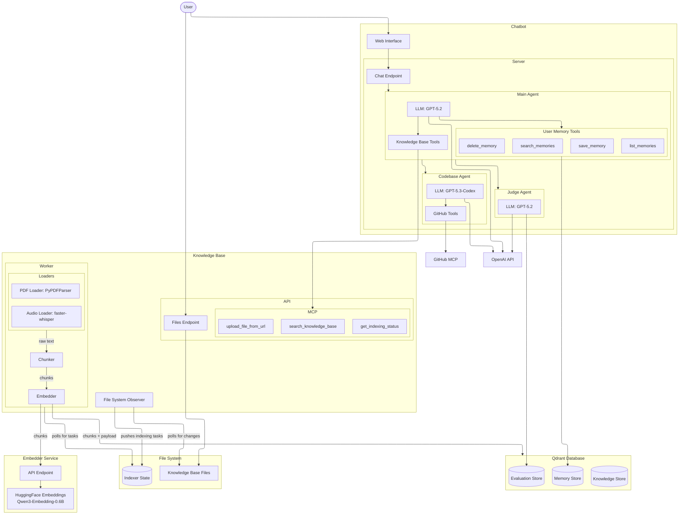

# AI Academy Capstone Project: Agentic RAG Assistant

Local multi-service RAG assistant with:

- Next.js chatbot UI and agent orchestration
- FastAPI knowledge base service with MCP tools
- FastAPI embedding service (Qwen3-Embedding-0.6B)
- Qdrant vector database
- Optional GitHub-powered codebase research agent

## Architecture

Live render: https://anddrrew.github.io/ai_academy_capstone/

Source file: [docs/architecture.mmd](./docs/architecture.mmd)



## Services

| Service         | Port | URL                             | Runtime                |
| --------------- | ---: | ------------------------------- | ---------------------- |
| Chatbot UI/API  | 3001 | http://localhost:3001           | Docker (Next.js)       |
| Knowledge Base  | 3002 | http://localhost:3002/docs      | Python (FastAPI + MCP) |
| Embedder        | 3003 | http://localhost:3003/docs      | Python (FastAPI)       |
| Qdrant          | 6333 | http://localhost:6333/dashboard | Docker                 |
| AI SDK Devtools | 4983 | http://localhost:4983           | Docker                 |

## Python Dependency Layout

- Root workspace: `pyproject.toml` + `uv.lock`
- Workspace members:
  - `packages/embedder/pyproject.toml`
  - `packages/knowledge_base/pyproject.toml`

## Prerequisites

- Docker + Docker Compose
- Python 3.11.14
- `uv` (https://docs.astral.sh/uv/#installation)

## Quick Start

1. Create `.env` from the template and fill required values.

```bash
cp .env.example .env
```

2. Install Python dependencies (workspace).

```bash
uv sync
```

3. Start Docker services.

```bash
docker compose up -d --build
```

4. Start Python services (embedder + knowledge base).

```bash
uv run python start.py
```

When startup is complete, open http://localhost:3001.

## Demo Flow (Recommended)

1. Open the chatbot at http://localhost:3001.
2. Upload or add knowledge base files.
3. Wait for indexing to complete.
4. Ask retrieval-style questions and verify source grounding.
5. (Optional) Trigger codebase research scenarios if `GITHUB__TOKEN` is configured.

## Logs

```bash
# all service logs
tail -f logs/*.log

# focused logs
tail -f logs/chatbot.log
tail -f logs/knowledge_base.log
tail -f logs/embedder.log
```

## Stop

```bash
# stop Python services
# (Ctrl+C in the terminal running start.py)

# stop Docker services
docker compose down
```

## Troubleshooting

- `Chatbot can't connect to KB MCP`: verify `KNOWLEDGE_BASE_MCP_URL` resolves to `http://host.docker.internal:3002/mcp/sse` inside Docker.
- `Embedding size mismatch`: ensure `EMBEDDING__VECTOR_SIZE` matches your embedder output size (default `1024`).
- `Qdrant unavailable`: check `docker compose ps` and confirm port `6333` is free.
- `uv project not synced`: run `uv sync`.
