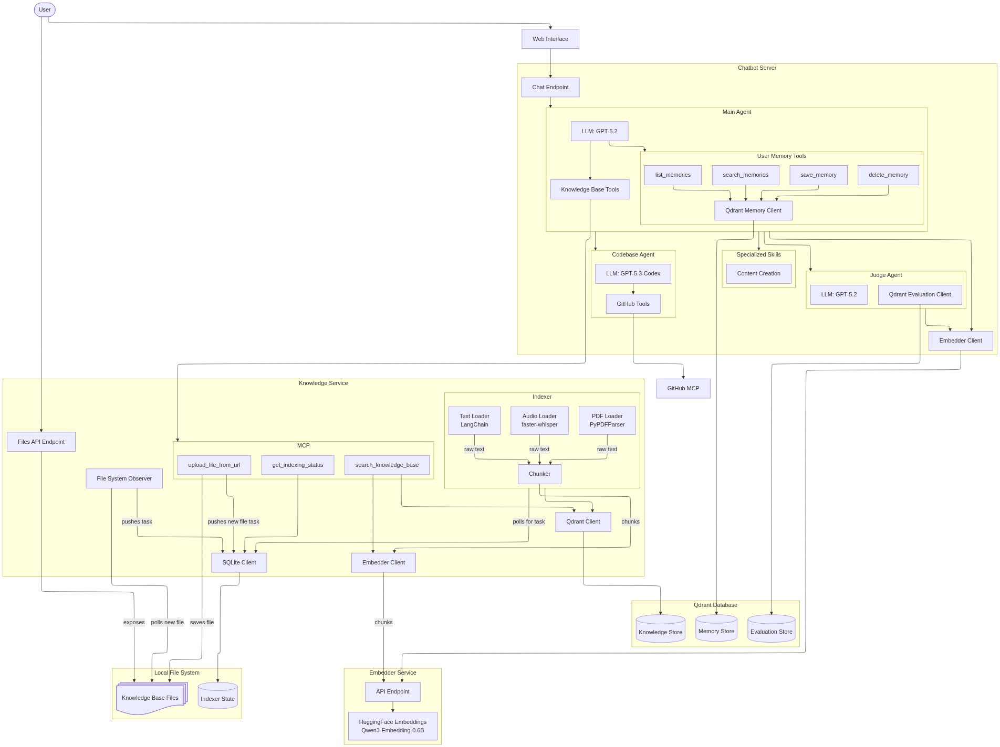

# AI Academy Capstone Project: Agentic RAG Assistant

## Table of Contents

- [What Is This Project?](#what-is-this-project)
- [Project Structure](#project-structure)
- [Architecture](#architecture)
- [Local Setup](#local-setup)
  - [Prerequisites](#prerequisites)
  - [Steps](#steps)
  - [Logs](#logs)
  - [Stop](#stop)
- [Upload Files to Knowledge Base](#upload-files-to-knowledge-base)

## What Is This Project?

Local multi-service RAG assistant with:

- Next.js chatbot UI and agent orchestration
- FastAPI knowledge base service with MCP tools
- FastAPI embedding service (Qwen3-Embedding-0.6B)
- Qdrant vector database
- Optional GitHub-powered codebase research agent

## Project Structure

```text
.
├── docs/                         # GitHub Pages architecture render
│   ├── index.html
│   └── architecture.mmd
├── knowledge_base/               # Uploaded source files to index
├── logs/                         # Runtime logs per service
├── packages/
│   ├── chatbot/                  # Next.js UI + agent orchestration
│   ├── embedder/                 # FastAPI embedding service
│   ├── knowledge_base/           # FastAPI KB + MCP + indexing worker
│   └── config.py                 # Shared Python config (env-driven)
├── docker-compose.yml            # Docker services (chatbot, qdrant)
├── pyproject.toml                # Root uv workspace config
├── uv.lock                       # Locked Python dependencies
├── start.py                      # Python service launcher/status dashboard
└── README.MD
```

## Architecture

[Link to diagram](https://anddrrew.github.io/ai_academy_capstone/)

[](https://anddrrew.github.io/ai_academy_capstone/)

- The project is split into microservices to keep responsibilities isolated and scalable:
  - `chatbot` for UI/agent orchestration
  - `knowledge_base` for indexing/search + MCP tools
  - `embedder` for centralized embeddings used by both chat and indexing flows
- This split came from an earlier monolithic version and made it easier to evolve components independently.
- I tested full Dockerization for a more production-like setup, but local audio indexing became about `3-5x` slower in Docker due to lack of Apple GPU acceleration (MPS) support in Docker for Mac, which is critical for Whisper performance.
- Current compromise for local development:
  - Docker Compose for infra + Node service (`qdrant`, `chatbot`)
  - Python services (`embedder`, `knowledge_base`) run on host via `uv run` for better local performance.

## Local Setup

### Prerequisites

- Docker + Docker Compose
- `uv` (https://docs.astral.sh/uv/#installation)

### Steps

1. Create `.env` from the template.

```bash
cp .env.example .env
```

Please, set required variables into file `.env`:

| Name              | Usage                | Description                              |
| ----------------- | -------------------- | ---------------------------------------- |
| `OPENAI__API_KEY` | OpenAI Responses API | OpenAI API key used by chatbot agents.   |
| `GITHUB__TOKEN`   | Github MCP           | GitHub token with readonly access to API |

Contact me via Google Chat if you need a test OpenAI API key or GitHub token.

2. Install Python dependencies.

```bash
uv sync
```

3. Start all services.

```bash
docker compose up -d --build && uv run python start.py
```

Service status notes:

- The first **embedder startup can be slow** because Qwen embeddings model loads into local cache.
- Knowledge base status has the form `state_of_service[state_of_indexer]` (example: `Running[idle]`).
- If you uploaded files before startup, wait until the indexer processes all files to get full RAG capabilities.
- You can start chatting earlier, but full RAG quality is available after indexing is done.
- Successful steady state should show:
  - `Embedder`: `Running[ok]`
  - `Knowledge_base`: `Running[idle]`

Example terminal output after successful startup:

```text
                                      RAG Services  (uptime: 0m 29s)
┏━━━━━━━━━━━━━━━━┳━━━━━━━━━━┳━━━━━━━━━━━━┳━━━━━━━━━━━━━━━━━━━━━━━━┳━━━━━━━━━━━━━━━━━━━━━━━━━━━━━━━━━━━━━━┓
┃ Name           ┃ Port     ┃ Runtime    ┃ Status                 ┃ URL                                  ┃
┡━━━━━━━━━━━━━━━━╇━━━━━━━━━━╇━━━━━━━━━━━━╇━━━━━━━━━━━━━━━━━━━━━━━━╇━━━━━━━━━━━━━━━━━━━━━━━━━━━━━━━━━━━━━━┩
│ Qdrant         │ 6333     │ Docker     │ Running                │ http://localhost:6333/dashboard      │
│ Chatbot        │ 3001     │ Docker     │ Running                │ http://localhost:3001                │
│ Embedder       │ 3003     │ Python     │ Running [ok]           │ http://localhost:3003/docs           │
│ Knowledge_base │ 3002     │ Python     │ Running [idle]         │ http://localhost:3002/docs           │
└────────────────┴──────────┴────────────┴────────────────────────┴──────────────────────────────────────┘
```

When all services are running successfully, go to `http://localhost:3001` to access the chatbot UI.
Service URLs:

- Chatbot UI/API: `http://localhost:3001`
- Knowledge Base: `http://localhost:3002/docs`
- Embedder: `http://localhost:3003/docs`
- Qdrant: `http://localhost:6333/dashboard`

### Logs

```bash
# all service logs
tail -f logs/*.log

# focused logs
tail -f logs/chatbot.log
tail -f logs/knowledge_base.log
tail -f logs/embedder.log
```

### Stop

```bash
# stop Python services
# (Ctrl+C in the terminal running start.py)

# stop Docker services
docker compose down
```

## Upload Files to Knowledge Base

Supported formats: PDF, MP3, MP4, TXT, MD, MARKDOWN.

Drop file into `knowledge_base/` folder into project root or upload asking chatbot to ingest file from URL. Prompt example:

```
Please, upload https://arxiv.org/pdf/2409.14924 into your knowledge base with file name "arxiv_2409.14924.pdf"
```

As this is a learning project, there are no proper file validation mechanisms, access control of reindexing existing files. Be careful with what you upload. In case of indexer issues

See current indexing status via knowledge base API:
GET http://localhost:3002/status

Also, you can trigger reindexing of all files in the knowledge base via API:
POST http://localhost:3002/reindex
